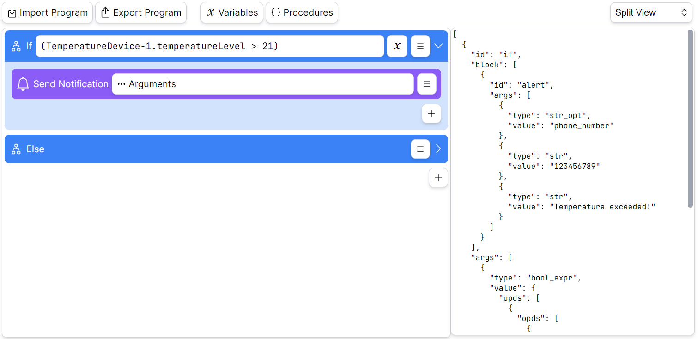
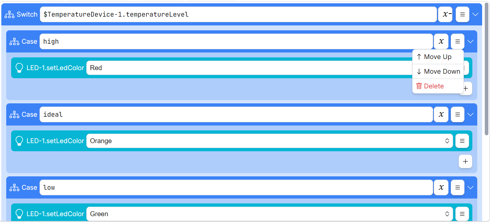
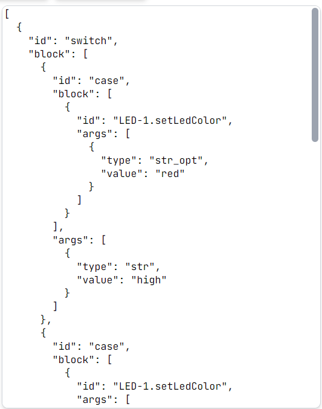
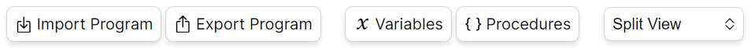
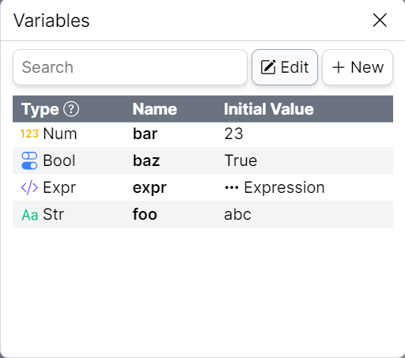
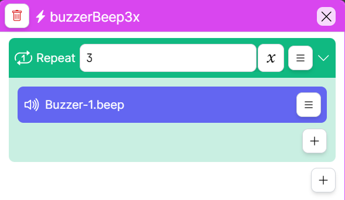

# VPL for Things

VPL for Things is a typescript library, that allows you to implement visual programming language into your web application. The library includes responsive visual editor for creating programs intended for IoT devices. Programs are stored as JSON files in a specific format and can be imported and exported.

You can try the editor demo [here](https://www.stud.fit.vutbr.cz/~xpodvo00/BP/).



## Main Features

- Expandable
- Responsive
- Easy to integrate
  - [Typescript](https://www.typescriptlang.org/)
- Framework agnostic
  - [Web Components](https://www.webcomponents.org/)
  - [Lit](https://lit.dev/)

## Installation

### NPM Package

You can use NPM package for integration into your own web project:

```sh
npm install @pocketix/vpl-for-things
```

Include the library from `node_modules` folder into your page:

```html
<!DOCTYPE html>
<html lang="en">
  <head>
    ...
    <script type="module" src="./node_modules/@pocketix/vpl-for-things/dist/vpl-for-things.js"></script>
    <link rel="stylesheet" href="./node_modules/@pocketix/vpl-for-things/dist/style.css" />
  </head>
</html>

```

Then use a `<vpl-editor></vpl-editor>` element that wraps the editor inside your HTML page, like you would use any other HTML Element:

```html
<body>
  ...
  <vpl-editor></vpl-editor>
</body>
```

### Local Project Setup

If you want to install and build the library locally for development purposes:

```sh
git clone https://github.com/podvojsky/vpl-for-things.git
```

```sh
cd vpl-for-things
```

```sh
npm install
```

#### Compile and Hot-Reload for Development

```sh
npm run dev
```

#### Type-Check, Compile and Minify for Production

```sh
npm run build
```

## Editor Overview

Editor consist of three main parts: controls, graphical view and text view. Graphical and text views are synchronized, so that all the changes that are made in graphical view are reflected in text view and vice versa.

### Graphical View

Graphical view consists of individual program statements. Users can expand, add, move or delete these statements using the appropriate buttons.



### Text View

Text view is intended for more experienced users that want to make quick changes directly in JSON program representation.



### Editor Controls



Editor controls are used to show different views, import and export program or access user variables and procedures.

### User Variables

Users can create their own variables for later usage in program. Variables have name, type and an initial value (so that users don't have to initialize them in the beginning of program).



### User Procedures

Users are allowed to create procedures (reusable parts of program) for better logic encapsulation and orientation in final program.


